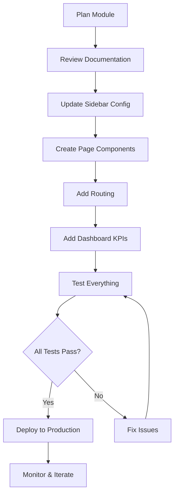

# Clientt Module System - Complete Guide

## 🎯 Overview

The Clientt platform is now built on a **scalable module architecture** that allows engineers to plug in new product modules (CRM, CPQ, Billing, Support) without re-architecting the navigation system.

---

## 📊 Current Status

### ✅ Active Modules
- **Dashboard** - Unified overview of all modules
- **Forms** - Complete forms management system with 4 sub-pages

### ⏸️ Coming Soon Modules
- **CRM** - Customer Relationship Management (3 sub-pages ready)
- **CPQ** - Configure, Price, Quote (3 sub-pages ready)
- **Billing** - Invoicing & Subscriptions (3 sub-pages ready)
- **Support** - Help Desk & Ticketing (3 sub-pages ready)

---

## 🗂️ Documentation Index

We've created comprehensive documentation to support rapid module development:

### 1️⃣ Quick Start Guide
**File:** [`/QUICK_START_NEW_MODULE.md`](/QUICK_START_NEW_MODULE.md)

**Use this when:** You need to activate a module quickly (30-45 min)

**Contains:**
- Step-by-step activation instructions
- Code templates
- Time estimates
- Common issues & solutions

---

### 2️⃣ Module Architecture Guide
**File:** [`/MODULE_ARCHITECTURE.md`](/MODULE_ARCHITECTURE.md)

**Use this when:** You need to understand the overall system design

**Contains:**
- Architecture overview
- Module structure best practices
- Styling guidelines
- Testing checklist
- Future enhancement roadmap

---

### 3️⃣ Sidebar Structure Reference
**File:** [`/SIDEBAR_STRUCTURE.md`](/SIDEBAR_STRUCTURE.md)

**Use this when:** You need to understand navigation behavior

**Contains:**
- Visual hierarchy diagrams
- Interaction patterns
- CSS class reference
- Accessibility guidelines
- Responsive behavior

---

### 4️⃣ Activation Checklist
**File:** [`/MODULE_ACTIVATION_CHECKLIST.md`](/MODULE_ACTIVATION_CHECKLIST.md)

**Use this when:** You're ready to activate a new module

**Contains:**
- Pre-activation checklist
- 6-step activation process
- Testing checklist (functional, visual, performance, accessibility)
- Post-activation tasks
- Rollback plan

---

### 5️⃣ Implementation Summary
**File:** [`/IMPLEMENTATION_SUMMARY.md`](/IMPLEMENTATION_SUMMARY.md)

**Use this when:** You need a high-level overview of what was built

**Contains:**
- What was implemented
- Files modified/created
- Module status table
- Benefits of the architecture
- Next steps for engineers

---

## 🚀 Quick Reference

### How to Activate a Module (TL;DR)

```bash
# 1. Enable in sidebar (5 min)
# Edit: /components/Sidebar.tsx
# Remove: disabled: true, badge: 'Coming Soon'

# 2. Create pages (30 min)
# Create: /components/pages/ContactsPage.tsx
# Create: /components/pages/DealsPage.tsx
# Create: /components/pages/PipelinePage.tsx

# 3. Add routing (5 min)
# Edit: /App.tsx
# Add: import statements + route cases

# 4. Add dashboard KPIs (10 min)
# Edit: /components/pages/DashboardPage.tsx
# Add: KPICard components

# 5. Test everything (15 min)
# Verify: Navigation, styling, responsiveness

# Total time: ~1 hour for basic module
```

---

## 📁 File Structure

```
/
├── App.tsx                          # Main routing logic
├── components/
│   ├── Sidebar.tsx                  # Collapsible module navigation
│   ├── Header.tsx                   # Top navigation bar
│   └── pages/
│       ├── DashboardPage.tsx        # Unified overview
│       ├── FormsPage.tsx            # Forms module
│       ├── AnalyticsPage.tsx        # Forms analytics
│       ├── CalendarIntegrationPage.tsx
│       ├── ChatbotPage.tsx
│       └── [Future: CRM, CPQ, Billing, Support pages]
│
└── Documentation/
    ├── MODULE_ARCHITECTURE.md       # System design guide
    ├── QUICK_START_NEW_MODULE.md    # Fast activation guide
    ├── SIDEBAR_STRUCTURE.md         # Navigation reference
    ├── MODULE_ACTIVATION_CHECKLIST.md
    └── IMPLEMENTATION_SUMMARY.md    # Overview
```

---

## 🎨 Visual Sidebar Structure

```
┌─────────────────────────────────────┐
│  [Clientt Logo]                     │
├─────────────────────────────────────┤
│                                     │
│  📊 Dashboard                       │  ← Global overview
│                                     │
│  📄 Forms                       ▼   │  ← Active module
│     ├─ 📄 Forms                     │
│     ├─ 📅 Calendar Integration      │
│     ├─ 💬 Chatbot                   │
│     └─ 📊 Analytics                 │
│                                     │
│  👥 CRM                    🔒 Soon  │  ← Coming soon
│  ✅ CPQ                    🔒 Soon  │
│  💳 Billing                🔒 Soon  │
│  🎧 Support                🔒 Soon  │
│                                     │
│  ─────────────────────────          │
│  ⚙️  Settings                       │
└─────────────────────────────────────┘
```

---

## 🔧 Technical Details

### Module Configuration

Each module is defined in `/components/Sidebar.tsx`:

```typescript
{
  id: 'crm',              // Unique ID for state management
  label: 'CRM',           // Display name
  icon: Users,            // Lucide icon
  badge: 'Coming Soon',   // Optional badge (remove when active)
  disabled: true,         // Enable/disable (set to false when active)
  items: [                // Sub-pages
    { icon: Users, label: 'Contacts' },
    { icon: FileText, label: 'Deals' },
    { icon: BarChart3, label: 'Pipeline' },
  ]
}
```

### Routing

Routes are defined in `/App.tsx`:

```typescript
case 'Contacts':
  return <ContactsPage searchQuery={globalSearchQuery} onNavigate={setActivePage} />;
```

### Dashboard KPIs

KPIs are added in `/components/pages/DashboardPage.tsx`:

```typescript
<KPICard
  title="Total Contacts"
  value="2,847"
  change={15.3}
  icon={Users}
  colorClass="bg-[#2278c0]"
  onClick={() => onNavigate('Contacts')}
/>
```

---

## 🎯 Benefits

### For Engineers
- ✅ **Fast Development** - 30-45 min to activate a basic module
- ✅ **Clear Patterns** - Consistent structure across all modules
- ✅ **Good Documentation** - Multiple guides for different needs
- ✅ **Easy Debugging** - Well-organized code with comments

### For Users
- ✅ **Intuitive Navigation** - Hierarchical menu structure
- ✅ **Visual Feedback** - Clear indicators for module status
- ✅ **Consistent Experience** - Same patterns across modules
- ✅ **Fast Performance** - Optimized routing and animations

### For Business
- ✅ **Scalable Architecture** - Easy to add new products
- ✅ **Modular Pricing** - Enable/disable modules per tier
- ✅ **Fast Time-to-Market** - Quick module activation
- ✅ **Future-Proof** - Built for expansion

---

## 📋 Activation Workflow



---

## 🧪 Testing Strategy

### 1. Unit Testing
- Component rendering
- State management
- Event handlers

### 2. Integration Testing
- Navigation flow
- Route transitions
- Active state updates

### 3. Visual Testing
- Light/dark mode
- Responsive breakpoints
- Hover/focus states

### 4. Accessibility Testing
- Keyboard navigation
- Screen reader support
- Color contrast

### 5. Performance Testing
- Load time
- Animation smoothness
- Memory usage

---

## 🎓 Learning Path

### New to the Project?
1. Start with `/IMPLEMENTATION_SUMMARY.md` - Get the big picture
2. Read `/SIDEBAR_STRUCTURE.md` - Understand navigation
3. Review existing Forms module code - See patterns in action

### Ready to Build?
1. Read `/QUICK_START_NEW_MODULE.md` - Follow step-by-step guide
2. Use `/MODULE_ACTIVATION_CHECKLIST.md` - Don't miss any steps
3. Reference `/MODULE_ARCHITECTURE.md` - For detailed explanations

### Want to Customize?
1. Study `/SIDEBAR_STRUCTURE.md` - Understand interaction patterns
2. Review `/MODULE_ARCHITECTURE.md` - Best practices and guidelines
3. Check existing components - Reuse when possible

---

## 📞 Support

### Questions?

**Architecture Questions:** See `/MODULE_ARCHITECTURE.md`  
**Activation Help:** See `/QUICK_START_NEW_MODULE.md`  
**Navigation Issues:** See `/SIDEBAR_STRUCTURE.md`  
**General Overview:** See `/IMPLEMENTATION_SUMMARY.md`

### Common Tasks

**Activate CRM Module:** Follow `/QUICK_START_NEW_MODULE.md`  
**Add New Sub-Page:** See Module Architecture → Adding New Module Pages  
**Update Dashboard KPIs:** See Implementation Summary → Dashboard Update  
**Debug Navigation:** See Sidebar Structure → Interaction Patterns

---

## 🎉 Success Metrics

### Module Activation Time
- **Minimum Viable:** 30-45 minutes
- **Full Featured:** 2-4 hours  
- **Production Ready:** 3-5 days

### Code Quality
- ✅ Consistent patterns across modules
- ✅ Well-documented with inline comments
- ✅ Type-safe with TypeScript
- ✅ Accessible (WCAG AA compliant)

### User Experience
- ✅ Intuitive navigation (< 2 clicks to any page)
- ✅ Fast performance (< 2 sec page load)
- ✅ Responsive design (mobile-first)
- ✅ Dark mode support

---

## 🚦 Next Steps

### Immediate (This Week)
1. Review all documentation
2. Test Forms module thoroughly
3. Plan CRM module architecture

### Short-term (This Month)
1. Build CRM module pages
2. Activate CRM module
3. Add CRM KPIs to dashboard
4. Train team on new module

### Medium-term (This Quarter)
1. Activate CPQ module
2. Activate Billing module  
3. Implement cross-module integrations
4. Add module-specific dashboards

### Long-term (Next Quarter)
1. Activate Support module
2. Add role-based module permissions
3. Create custom module builder
4. Optimize for enterprise scale

---

## 📊 Module Roadmap

| Module | Q1 2025 | Q2 2025 | Q3 2025 | Q4 2025 |
|--------|---------|---------|---------|---------|
| **Forms** | ✅ Active | Enhance | V2 | V3 |
| **CRM** | 🚧 Build | ✅ Launch | Enhance | V2 |
| **CPQ** | 📋 Plan | 🚧 Build | ✅ Launch | Enhance |
| **Billing** | 📋 Plan | 📋 Plan | 🚧 Build | ✅ Launch |
| **Support** | 💡 Research | 📋 Plan | 📋 Plan | 🚧 Build |

Legend:
- 💡 Research
- 📋 Plan
- 🚧 Build
- ✅ Launch
- Enhance = Add features
- V2/V3 = Major version updates

---

## 💡 Pro Tips

1. **Start Small** - Activate one module at a time
2. **Reuse Components** - Don't rebuild what exists
3. **Follow Patterns** - Look at Forms module as reference
4. **Test Thoroughly** - Use the full checklist
5. **Document Changes** - Keep docs up to date

---

**Built with ❤️ by the Clientt Team**

*Last Updated: [Current Date]*  
*Module System Version: 1.0*
